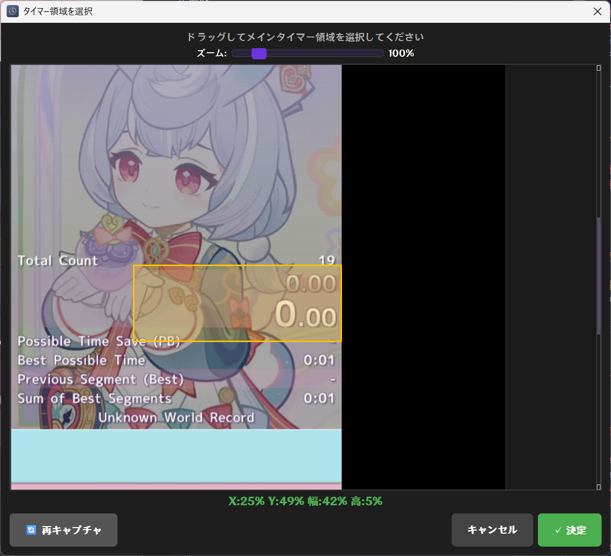

# AutoSplit GIEEE 取扱説明書

**AutoSplit GIEEE** は、ゲーム画面のロード時間（特定の画像パターン）を自動検知し、LiveSplitなどのタイマーツールへホットキーを送信するためのツールです。
精鋭狩りRTAでlivesplitを導入しようと考えてる方はこっちでやったほうがAutosplit準備するより楽だと思います

AutoSplit Genshin Impact Elite Enemies Edition ね！

---

## 📥 インストールと起動

1. **配置**: 配布された `AutoSplitGIEEE.exe` を任意のフォルダに置きます。
2. **起動**: `AutoSplitGIEEE.exe` をダブルクリックして起動します。
   - ※ 設定ファイル `config.json` が同じフォルダに自動作成されるので注意してください。

---

## ⚙️ 初期設定

### 1. 監視対象の設定
起動したら、まず画面上の「⚙️ 設定」ボタンを押します。

- **監視対象ウィンドウ**: 
  - メニューからゲームのウィンドウ名（`Genshin Impact` または `原神`）を選択します。
  - リストにない場合はロードボタンを押して更新してください。
  - ※ LiveSplitの自動停止機能を使う場合は「LiveSplitウィンドウ」も設定してください。

- **タイミング設定**:
  - **クールダウン**:  ロードを検知してから次の検知開始までの時間です。3000ms(3秒)が初期値です。
  - **検知間隔**:      ロードチェックの間隔です。重いと感じた場合は値を大きくしてください。

- **LiveSplit自動停止**
  - LiveSplitのタイマー停止を検知して、タイマーが止まった後はAutosplit側も動作を停止するオプションです。
  - **ON/OFF**:                 不要な場合はOFFにしてください。
  - **LiveSplitウィンドウ**:     LiveSplitのウィンドウ名を指定してください。 
  - **タイマー領域**:            LiveSplitのメインタイマー部分を選択してください。
  
  - **最低ホットキー回数**  :   　開始時や再開時に自動停止されないための設定です。特にいじる必要はないです。最低ここに指定した回数のﾛｰﾄﾞを検知してから自動停止がONになります。

- **LiveSplit側の設定**:
  - LiveSplit側で「Global Hotkeys」を有効にしてください。
  - 本ツールから送信するキー（Spaceなど）を、LiveSplitの「Start / Split」キーに設定してください。

---

## 🎯 パターンの作成（ロード検知設定）

ロード画面の色を登録して、検知できるようにします。
「設定」画面の「**パターン設定**」タブを開きます。
デフォルトで原神の昼ロード、夜ロードの画面の設定されてるのでスポイトとかはそのままでもいけるはず

### 手順
1. **追加**: 「➕ パターンを追加」ボタンを押します。
2. **名前**: 「ロード画面（黒）」など、分かりやすい名前をつけます。
3. **キー設定**: 
   - 「ホットキー」欄をクリックし、設定します（例: `F11`）。
   - ここで設定したキーが、検知時に自動送信されます。
4. **色指定**:
   - 「🎨 スポイト」ボタンを押し、実際のゲーム画面上の「ロード中に表示される背景色」をクリックして取得します。
5. **検知エリア設定**:
   - 下部のプレビュー画面で、**検知したい場所**をマウスでクリックします。
   - 緑色の枠（エリア）が表示されます。複数のエリアを設定できます。
   - **ポイント**: 
     - ロード中だけその色になる場所を選びます。
     - キャラアイコンやミニマップがある場所など、常に同じ場所に表示されるものを囲むと精度が上がります。
6. **調整**:
   - 基本はそのままでOKですが、検知しにくい場合は「色許容値」や「検知閾値」を調整してください。
   - ｵｽｽﾒ設定は　色許容値 : 10  検知閾値 : 90  で、誤検知が起きる場合は検知エリアを増やすのがいいかも

---

## ▶️ 使い方（監視の開始）

1. 設定画面を「保存」して閉じます。
2. メイン画面の **緑色のボタン「▶ ﾛｰﾄﾞ監視ｽﾀｰﾄ！」** を押します。
3. ボタンが **赤色の「■ ﾛｰﾄﾞ監視ｽﾄｯﾌﾟ」** に変わり、監視が始まります。
4. ゲームをプレイします。設定したパターン（ロード画面）が検知されると、自動的にホットキーが送信され、タイマーがｽﾌﾟﾘｯﾄされます。

---

## ❓ トラブルシューティング

- **Q. 全く反応しない**
  - A. LiveSplitを管理者権限で起動している場合、本ツールも管理者権限が必要になることがあります。
  - A. 検知エリアの色が微妙に変わっている可能性があります。「色許容値」を少し上げてみてください。

- **Q. 誤作動する**
  - A. 通常のプレイ画面でも似たような色になる場所をエリア指定していませんか？
  - A. 検知エリアを増やして、複数の箇所が一致したときだけ反応するようにすると誤作動が減ります。

- **Q. アプリが消えた？**
  - A. 最小化機能はありません。×ボタンで終了します。

- **Q. ダウンロード時や実行時に警告が出る**
  - A. 本ソフトは個人開発のため、デジタル署名を行っていません。そのため、Windowsやブラウザのセキュリティ機能によって警告が表示されることがあります。
  - **ブラウザの場合**: 「...」メニューなどから「保存」→「詳細表示」→「保持する（このまま保存）」などを選択してください。
  - **実行時（Windows SmartScreen）**: 「WindowsによってPCが保護されました」と表示された場合、「詳細情報」をクリックし、「実行」ボタンを押してください。

## 🏥 お問い合わせ・不具合報告
機能追加要望や不具合報告はDiscordやTwitterにてお願いします！
匿名で意見送れるようにﾏｼｭﾏﾛも開設してみました。

* **X (Twitter)**: [@_c_aca](https://x.com/_c_aca)
* **Discord**: rnilideci
* **ﾏｼｭﾏﾛ**: https://marshmallow-qa.com/r7v3wdxtw91vc6b
